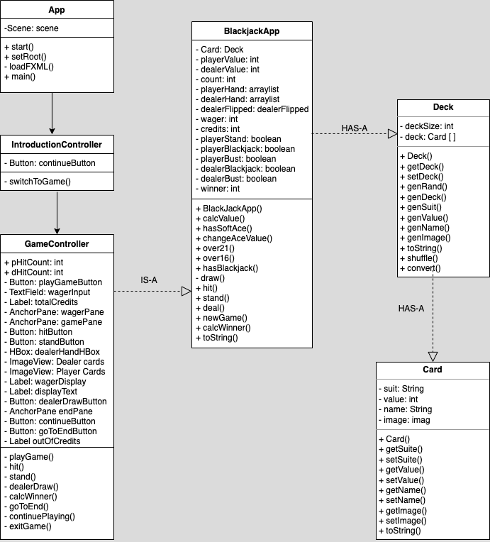
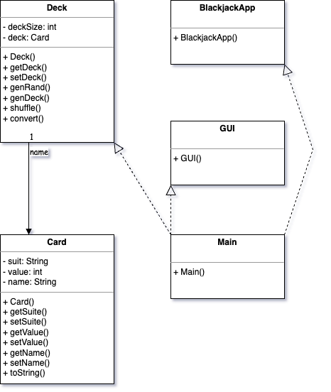

# Blackjack

## Final Project Submission

### Theme
The goal of this project was to create a game using object-oriented programming. This submission fulfilled the idea of using objects interacting with eachother by using a Deck which has elements of an array of Cards, and using the logic of Blackjack to fulfill the idea portrayed.

### List of features
The game will follow the rules of US blackjack. Deck class has-a Card class: creates a deck that can be randomized/redrawn for the dealer and player at the start of a new round. Int inputs can be taken in for the wager, which will then be implemented as the bet placed for the round. During the round, the player can choose to hit and gain a new card, or stand and allow the dealer to draw their cards. Win or lose, the total points owned are updated after the round ends.

### UML Diagram

### Screenshots 

### Videos
Execution of the game:
https://youtu.be/dHVl62xjCdY

Code:
https://youtu.be/vOzy8sbGWCw

### Issues and Future Work
There are no known issues present within this project. Future work will consist of implementation of split and double down, to truly follow the rules of American Blackjack.

### What classes do you have? Name each: 
  1)	BlackjackApp
  2)	Card
  3)	Deck
### Between which classes do you have composition? 
  We implemented our HAS-A relationship between our classes BlackjackApp and Deck, our second HAS-A relationship is between our classes Deck and Card.
### Between which classes do you have inheritance? 
  We implemented inheritance between our GameController and BlackjackApp. Our Class GameController inherits from BlackjackApp.
### Name the class that is abstract or is an interface. 
  We were unable to implement this requirement in our project.
### Where is the polymorphic call in your program and how does it become a polymorphic call? 
  We were unable to implement this requirement in our project.
### Where do you use an array or ArrayList in your code? 
  We have 2 ArrayLists implemented in BlackjackApp called playerHand and dealerHand
### The JavaFX FXML GUI should include
### What panes did you use and where in the program? At least 2 different class Pane or its subclasses
  We have used Multiple Nested AnchorPanes on our two main scenes.
### What controls did you use and where in the program? At least 3 different Javafx controls:
  We used multiple JavaFx controls namely:
  Buttons, TextFields, Labels, ImageViews, AnchorPanes and HBoxes
  
  

## Project Proposal

### Theme
The goal of this project is to sufficiently learn how to develop a game using object-oriented programming. Blackjack was one of the initial ideas, allowing for creation of Cards and Decks which interact with eachother using objects, fulfilling the purpose.

### List of features
The game will follow the rules of US blackjack. Deck class has-a Card class: creates a deck that can be randomized/redrawn for the dealer and player at the start of a new round. The player can use points to bet against the dealer and gain more points. Int inputs can be taken in for the wager, which will then be implemented as the bet placed for the round. Win or lose, the total points owned are updated after the round ends. During the round, the player can choose to hit and gain a new card, or stand and allow the dealer to draw their cards.

### UI Sketch

### UML Diagram

